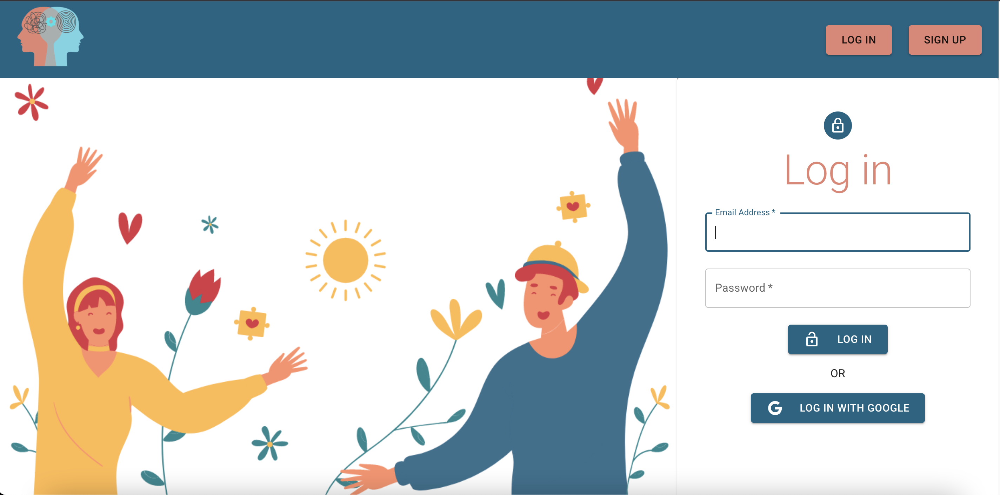
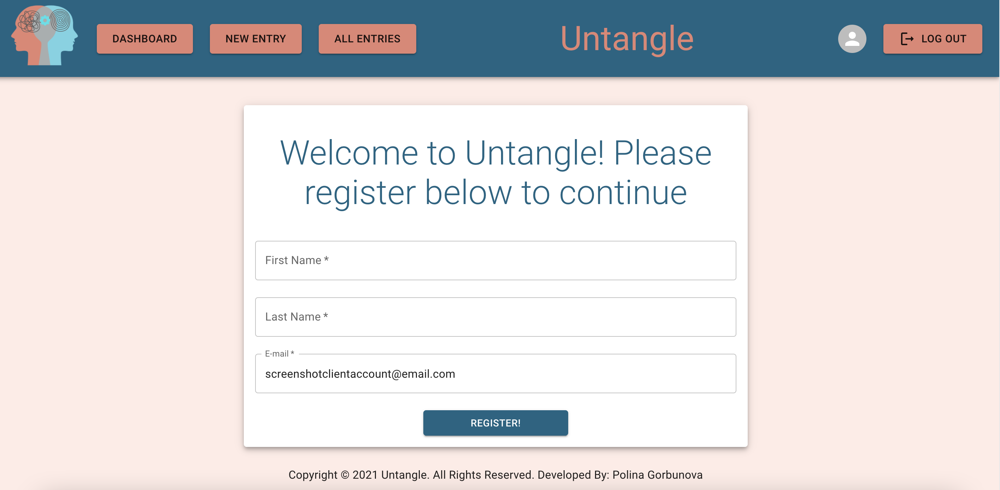
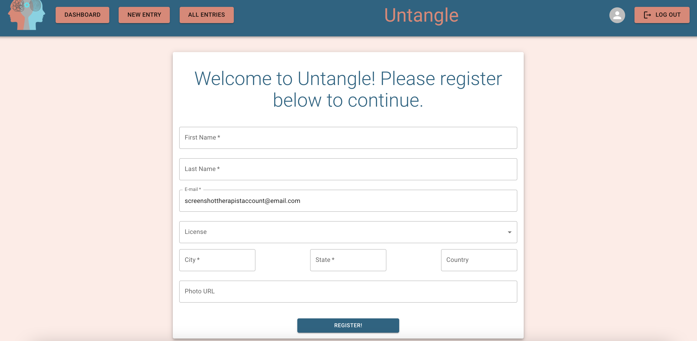
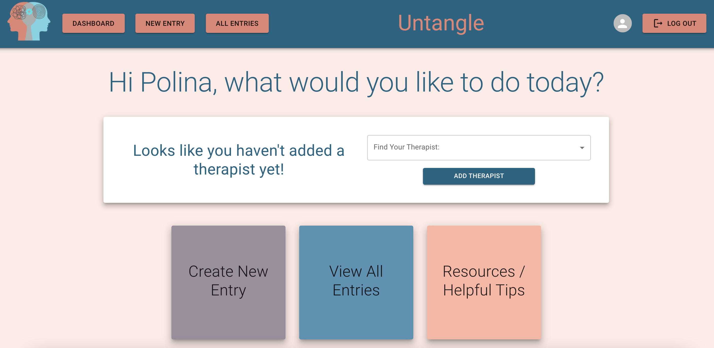
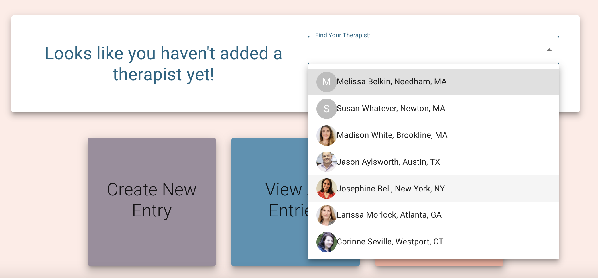
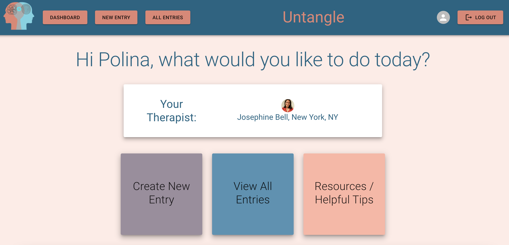
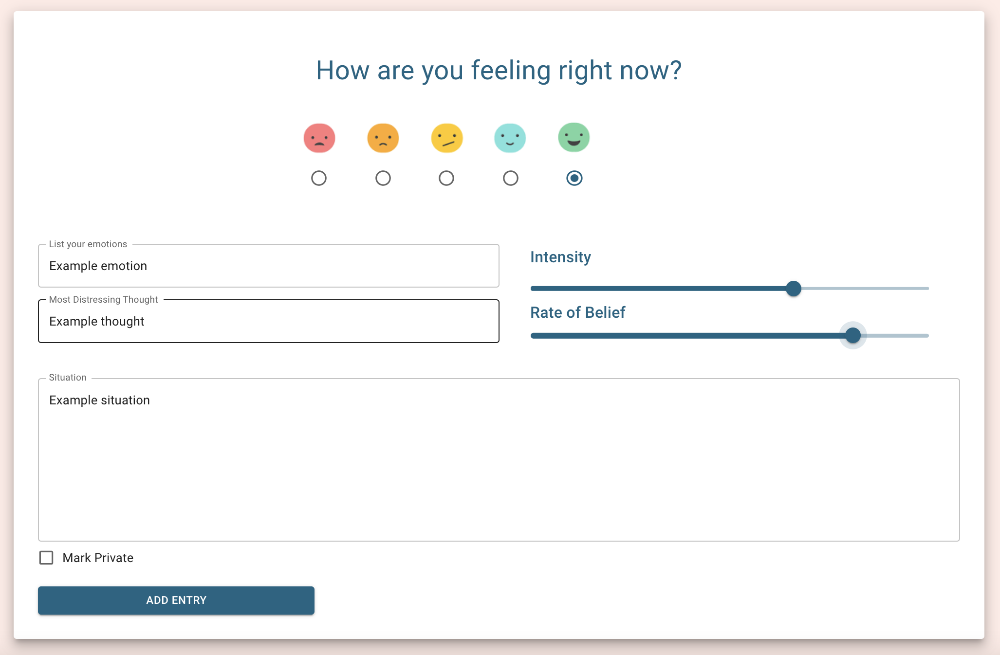
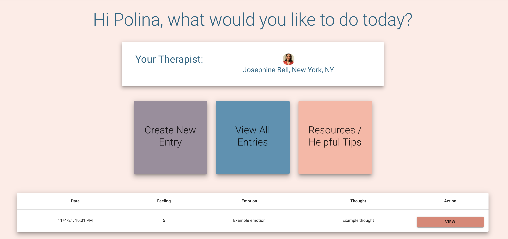
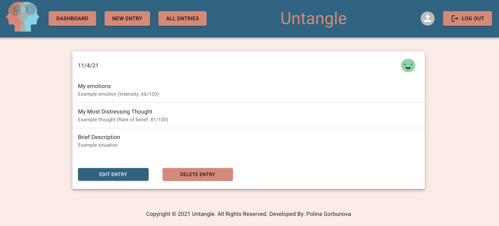

# WELCOME TO UNTANGLE

As a clinical psychologist turned sofrware engineer, I have always been passionate about the mental health field along with the most meaningful, evidence based and effective practices it has to offer. With the skills and tools I have gained in my journey as a developer, I was inspired to create a website that not only meets requirements and showcases my aquired skills, but which also provides a useful tool for mental health professionals and their clients. In my years of working in the feild I have felt a gap in communication between client and therapists: therapists only see what the client presents during a weekly one hour session, and clients often are too embarassed to be truthful and honest about their experiences. This can often prolong the amount of time needed for the therapist to provide useful and effective intervetions, and when talking about someone's mental health - very often every single week matters.  

More specifically, cognitive behavioral therapists often rely on clients filling out CBT journals in the time between their sessions, where they log their feelings, thoughts and emotions throughout the week. This information is invaluable to the therapist and is often vital to successful treatement. Having to once fill out one of these journals myself, I can confidently say that many times this assignment is skipped or done haphazardly due to the inconvenience of the task. Untange provides a convenient and quick way for clients to record their negative thought patterns on the go! Not only that - Untangle also provides a platform for therapists as well: mental health professionals can creare their own accounts and connect with their clients, seeing their new journal posts in real time! 

I trult believe Untangle can be the perfect solution to succesful and, most importantly, helpful therapeutic work between a client and their therapist. Feel free to take a peek inside!

# Technologies Used 

- HTML5
- CSS3
- JavaScript
- React
- Node.js
- Express
- MongoDB and Mongoose
- Materialize UI
- Google Firebase

# Screenshots
### Sign Up Pafe

### Login Page

### Client's registration page

### Therapist Registration Page

### Empty Client Dashboard

### Find your Therapist

### Dashboard after therapist added

### Create New Entry

### Dashboard with Added Entry

### View, Edit and Delete Entries

### And Many More...

## Getting Started
- Click on the link below to open the website
- Create a new account or use Google Sign In to sign in (Make sure to choose client or therapist when creating a new account - the website will default to a client account if option not chosen)
- Currently the therapist experience is under development, but feel free to create an account and lookout for future releases!
- Create new entries and keep track of your thoughts, feelings and emotions! You'll be surprised at the patterns you can unvover!
- Look out for new realeses: more features to come as this is currently under development!

[Click here](https://untangle.netlify.app/) to open the deployed project.

# Future Releases Will Include:

### 1. Fully functional therapist account where you can view your clients' entries as soon as they are posted!
### 2. Receive an alert when one of your clients posts a journal entry.
### 3. Analyze and look at graphical representations of patterns of thoughts, emotions and behavior.
### 4. Added resources, tips and helpful information for clients to utilize as needed.

## Stay on the lookout!!!

# Author
- [Github Profile](https://github.com/polina-g) 
- [Twitter](https://twitter.com/ThisIsPolinaG)
- [LinkedIn](linkedin.com/in/polina-gorbunova-71657170)